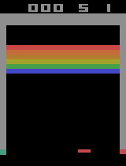
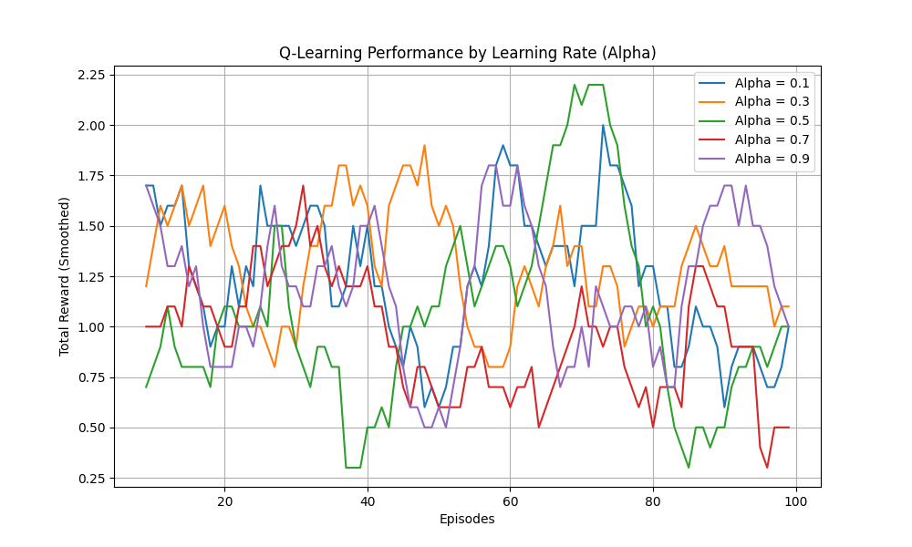
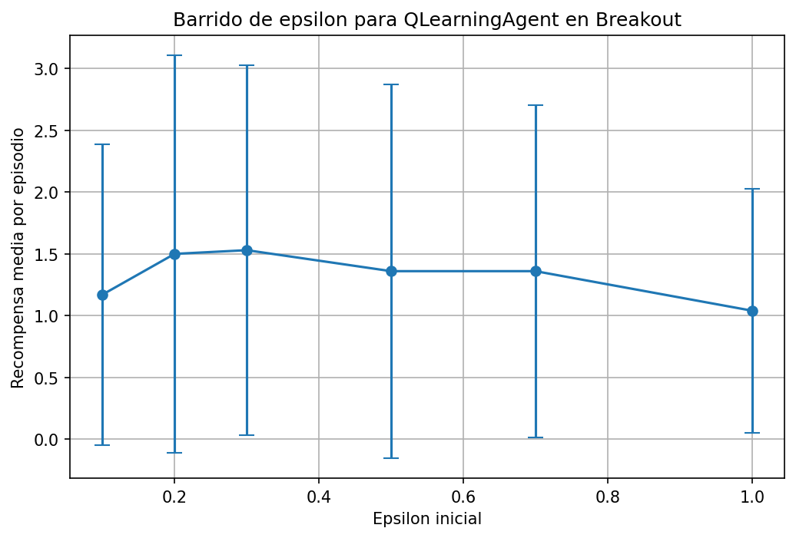
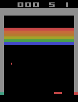
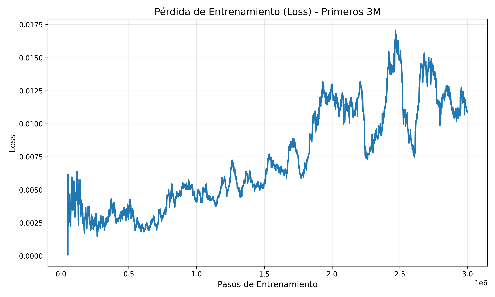
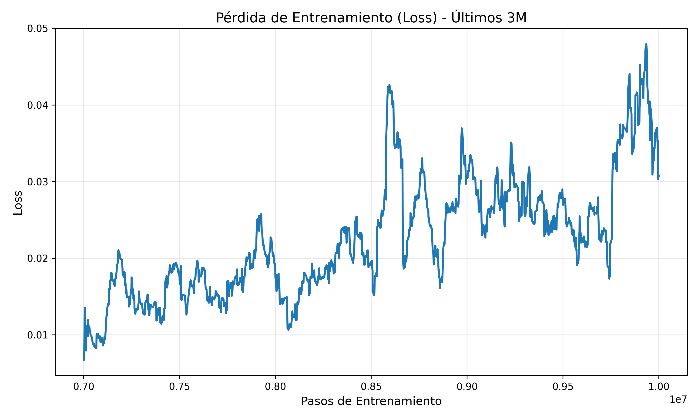

<p style="text-align:center; font-size:20px;">
<strong>LCC - Facultad de Ingeniería - UNCUyo</strong><br>
<strong>Inteligencia Artificial 1</strong> &nbsp;&nbsp;&nbsp; Prof. Carlos A. Catania (Harpo) - Prof. Tatiana Parlanti
</p>

---

<p style="text-align:center; font-size:24px;">
<em>Aprendizaje por refuerzo para Atari Breakout</em>
</p>

<p style="text-align:center;">
<strong>Código:</strong> ARABIM
</p>

<p style="text-align:center;">
<strong>Integrantes:</strong> Coppede Santos Ignacio, Sorbello Mauro
</p>

---

<p align="center">
  
</p>

## Introducción

**Atari Breakout**, lanzado el **13 de mayo de 1976**, es un videojuego arcade clásico.  
La dinámica del juego consiste en que el jugador controla una **raqueta horizontal** ubicada en la parte inferior de la pantalla, moviéndola de izquierda a derecha.

En la parte superior se encuentra una **banda de ladrillos**.  
Una **bola** desciende y el jugador debe golpearla con la raqueta, haciendo que rebote hacia arriba para impactar y destruir los ladrillos, los cuales desaparecen al ser golpeados. El objetivo es **eliminar por completo la pared de ladrillos**.

El presente proyecto busca **entrenar un agente mediante aprendizaje por refuerzo**, evaluando mediante métricas específicas.

## Marco Teórico

### Aprendizaje por refuerzo
El **aprendizaje por refuerzo** es el proceso mediante el cual un agente aprende a comportarse en un entorno observando las consecuencias de sus acciones, sin recibir instrucciones explícitas sobre cuál acción es correcta. El agente debe descubrir una política que maximice la utilidad esperada, guiado únicamente por la retroalimentación en forma de recompensas obtenidas al ejecutar acciones. El aprendizaje ocurre durante la interacción con el entorno y no mediante ejemplos preetiquetados, lo que hace del RL un enfoque adecuado para tareas secuenciales donde deben considerarse tanto recompensas inmediatas como futuras (Russell & Norvig, 2021).

### Random

El agente Random selecciona sus acciones de forma aleatoria, sin ningún criterio basado en el estado del entorno. Este tipo de agente es útil como baseline de muy bajo desempeño para evaluar qué tan difícil es la tarea y qué tan bien se desempeñan agentes más sofisticados. Contrastar con este baseline permite medir el valor añadido de algoritmos como DQN o heurísticos como FollowBall.

### FollowBall

El agente FollowBall no es un algoritmo de aprendizaje por refuerzo, sino una estrategia heurística diseñada para servir como referencia simple. En lugar de entrenar parámetros mediante experiencia acumulada, este agente utiliza reglas fijas que intentan posicionar la pala bajo la pelota en todo momento, con el objetivo de minimizar pérdidas y maximizar interacciones útiles. Aunque no aprende, proporciona una línea base determinista contra la cual comparar agentes aleatorios y entrenados. (Concepto heurístico común en trabajos de RL aplicado a Breakout, usado como referencia simple.)


### Q-Learning
El algoritmo se centra en aprender la **función de acción-valor** \( Q(s, a) \), que estima la utilidad esperada de realizar una acción \( a \) en un estado \( s \) y continuar luego siguiendo la política óptima. Debido a que actualiza los valores utilizando el **máximo** de las acciones disponibles en el próximo estado, Q-Learning es un método *off-policy*: el agente puede explorar acciones arbitrarias mientras aprende la política óptima.

La regla de actualización clásica es:

$$
Q(s, a) \leftarrow Q(s, a) + \alpha (r + \gamma \max_{a'} Q(s', a') - Q(s, a))
$$

donde:

- $\alpha$ es la tasa de aprendizaje  
- r es la recompensa inmediata  
- $\gamma$ es el factor de descuento  
- s' es el estado resultante de ejecutar la acción \( a \)  
- $\max_{a'}$ Q(s',a')$ representa el valor estimado de la mejor acción futura  

#### Justificación de elección

Q-Learning, aun con su bajo rendimiento en entornos de alta complejidad como Breakout, resulta valioso dentro del proyecto porque permite analizar las limitaciones de los métodos tabulares frente a espacios de estados grandes. Su incorporación ofrece una base clara desde la cual entender cómo la falta de generalización afecta la política aprendida y por qué la aproximación con funciones es necesaria. Además, funciona como un punto de contraste útil para evaluar el salto conceptual y práctico que introducen algoritmos más modernos como DQN.

### DQN

DQN extiende el enfoque de Q-Learning utilizando una red neuronal convolucional como aproximador de la función $Q(s,a)$, lo que permite operar directamente sobre secuencias de imágenes y manejar espacios de estados de gran dimensionalidad como los que presenta Breakout[4]. En este esquema, los frames apilados del entorno conforman la entrada de la red, que aprende a estimar los valores Q para todas las acciones posibles y, a través de ello, a capturar tanto la dinámica espacial como la temporal del juego. Esta aproximación permite superar las limitaciones de los métodos tabulares, incapaces de generalizar entre millones de configuraciones visuales.

Para estabilizar el aprendizaje, DQN incorpora mecanismos fundamentales que resultan esenciales en entornos Atari. El experience replay almacena transiciones en un búfer grande y entrena a la red usando mini-lotes muestreados aleatoriamente, reduciendo la correlación entre pasos consecutivos y mejorando el uso de datos. A su vez, la target network, una copia de la red principal que se actualiza con menor frecuencia, proporciona objetivos más estables al calcular el valor de actualización, evitando oscilaciones numéricas y divergencias durante el entrenamiento prolongado. Estas estrategias combinadas permiten que el agente aprenda políticas efectivas incluso en escenarios de alta complejidad visual.

### Justificación de elección

DQN fue seleccionado porque constituye el enfoque estándar para aprender desde observaciones visuales en Atari y representa un avance fundamental respecto del Q-Learning tabular, que no puede manejar espacios de estados tan amplios. Su capacidad para extraer características relevantes directamente de imágenes y su estabilidad derivada de técnicas como replay buffer y target networks lo convierten en la elección adecuada para un entorno como Breakout. Además, su inclusión en el proyecto permite contrastar de manera clara cómo los métodos de deep reinforcement learning superan las limitaciones observadas previamente con el agente tabular, tanto en términos de generalización como de rendimiento.

## Diseño Experimental

### Métricas Principales
Las siguientes métricas fueron utilizadas para la evaluación comparativa del desempeño de cada agente.

#### 1. Recompensa Total (Total Reward)
- **Definición**: La suma acumulada de las recompensas obtenidas en un episodio.
- **Fuente**: Retornado por `env.step()` como `reward`.
- **Interpretación**: Indica qué tan bien jugó el agente. Mayor puntaje es mejor.

#### 2. Duración del Episodio (Episode Length)
- **Definición**: Cantidad total de acciones ejecutadas (`steps`) hasta que el episodio termina.
- **Fuente**: Contador interno incrementado en cada iteración del bucle principal.
- **Interpretación**: Episodios más largos sugieren que el agente pudo mantener la pelota en juego durante más tiempo, aunque no necesariamente implica buen puntaje si no destruyó ladrillos.

#### 3. Golpes a Ladrillos (Brick Hits)
- **Definición**: Número de veces que la bola golpea un ladrillo.
- **Fuente**: Inferido cuando `delta_reward > 0`.
- **Interpretación**: Mide la efectividad ofensiva del agente. Valores altos indican que el agente logró avanzar en la destrucción de la pared de ladrillos.


## Herramientas y Entornos

Para el desarrollo del proyecto se utilizaron diferentes librerías y herramientas dentro del ecosistema de Python, empleando la versión **3.13.9** del lenguaje.

Con respecto al entorno de ejecución, se utilizó **ALE-py** junto a **Gymnasium**, que proporcionan una interfaz estándar para la ejecución de juegos de Atari. En particular, se trabajó con la versión **"Breakout-v5"**, y para los agentes basados en aprendizaje profundo se empleó también la variante **"BreakoutNoFrameskip-v4"**, necesaria para el correcto funcionamiento de algoritmos de control como DQN.

El script de evaluación crea dos tipos de entornos según el agente:
- Para **Random** y **FollowBall** se utilizó:
  ```python
  gym.make(
      "ALE/Breakout-v5",
      obs_type="rgb",
      full_action_space=False,
  )
Este entorno proporciona observaciones RGB y un espacio de acciones reducido, facilitando el procesamiento y la comparación entre agentes no profundos.

- Para el agente **QLearning** y **DQN** (Stable-Baselines3), se utilizó un entorno vectorizado:
    ```python
    env = make_atari_env("BreakoutNoFrameskip-v4", n_envs=1)
    env = VecFrameStack(env, n_stack=4)
  
Esta configuración es estándar en experimentos con Deep RL, ya que permite apilar frames consecutivos para capturar información temporal que el modelo necesita.


## Agentes de Línea Base

Antes de aplicar algoritmos de aprendizaje, se implementaron dos agentes básicos para establecer métricas de referencia.

### 1. Agente Aleatorio (Random)



Este agente selecciona una acción al azar del espacio de acciones disponible en cada paso de tiempo ($A = \{NOOP, FIRE, RIGHT, LEFT\}$).
- **Propósito**: Establecer el límite inferior de desempeño. Cualquier agente "inteligente" debería superar a este comportamiento.
- **Implementación**: Utiliza `env.action_space.sample()`.

### 2. Agente Heurístico (FollowBall)


Este agente utiliza técnicas de visión por computadora clásica (procesamiento de imágenes) para rastrear la pelota y mover la paleta en consecuencia.
- **Lógica**:
  1. Detecta la posición horizontal ($x$) de la pelota y de la paleta filtrando píxeles rojos en la imagen RGB.
  2. Calcula la diferencia entre ambas posiciones.
  3. Si la pelota está a la derecha, mueve la paleta a la derecha; si está a la izquierda, a la izquierda.
  4. Incluye una lógica de "disparo automático" si la pelota no se detecta por varios frames (indicando que se perdió una vida o el juego está en espera).
- **Limitaciones**: Es reactivo y tiene un retraso inherente al movimiento. No predice rebotes ni planifica a largo plazo, pero es muy efectivo para mantener la pelota en juego en niveles bajos.

## Agentes de Inteligencia Artificial

### Q-Learning


Para el agente tabular de Q-Learning se diseñó una estrategia específica orientada a explotar información geométrica del entorno (posición de la pelota y de la pala) sin recurrir a redes neuronales. El objetivo principal fue aprender una política que mantenga la pelota en juego y logre impactar la mayor cantidad posible de ladrillos, utilizando una representación de estado discreta y recompensas moldeadas (*reward shaping*).

#### Representación del estado

En lugar de trabajar directamente con la imagen cruda, se implementó un detector simple sobre los frames RGB del entorno `ALE/Breakout-v5`:

- Se detecta la **pala** en la parte inferior de la pantalla mediante umbrales de color.
- Se detecta la **pelota** en la zona de juego, también por color, tomando el píxel más bajo (más cercano a la pala).
- A partir de estas detecciones se construye un estado discreto de la forma:

`ball_x_bin`, `ball_y_bin`, `paddle_x_bin`, `dx` y `dy` 

donde:

- `ball_x_bin`, `ball_y_bin` y `paddle_x_bin` son las posiciones de pelota y pala discretizadas en una grilla de tamaño `grid_size = 10` píxeles.
- `dx`, `dy` indican la **dirección de movimiento de la pelota** (–1, 0 o 1), calculada a partir de la posición actual y la anterior.
- En el caso de no detectar pelota (por ruido u oclusión), se utiliza un estado genérico `(-1, -1, -1, 0, 0)`.

Este estado discreto se usa como clave de la **Q-table**, donde cada estado almacena un vector de valores Q para cada acción disponible.

#### Reward shaping

Aunque se conserva la recompensa original del entorno para las métricas, durante el entrenamiento se empleó una recompensa moldeada (*shaped_reward*) para acelerar el aprendizaje. A partir del `reward` del entorno, se aplicaron las siguientes modificaciones:

- **Pérdida de vida**:  
  - Penalización fuerte de `–1.0` cada vez que el agente pierde una vida.  
  - Objetivo: desalentar comportamientos arriesgados que lleven a muertes frecuentes.

- **Movimiento de la pelota**:
  - Si la pelota se desplaza hacia abajo (se acerca a la pala): `+0.1`.  
  - Si la pelota se aleja (se mueve hacia arriba): `–0.05`.  
  - Objetivo: incentivar al agente a “prestar atención” a momentos en que la pelota se acerca, donde la acción de la pala es crítica.

- **Movimiento de la pala respecto a la pelota**:
  - Cuando la pelota se mueve hacia abajo, si la pala se acerca horizontalmente a la posición de la pelota (la distancia actual es menor que la anterior): `+0.05`.  
  - Objetivo: recompensar directamente los movimientos que alinean la pala con la pelota.

La combinación de estos términos busca que el agente no solo reciba recompensa al romper ladrillos, sino que también aprenda a posicionarse correctamente y evitar perder vidas.

#### Hiperparámetros

El agente Q-Learning se inicializó con los siguientes valores:

- **alpha (tasa de aprendizaje)**: 0.5  
- **gamma (factor de descuento)**: 0.99  
- **epsilon inicial (exploración)**: 1.0  
- **epsilon_decay**: 0.9995  
- **epsilon_min**: 0.01  
- **alpha_decay**: 1.0  
- **alpha_min**: 0.05  
- **grid_size**: 10 píxeles

Al final de cada episodio se aplican `decay_epsilon()` y `decay_alpha()` para ir reduciendo gradualmente la exploración y la magnitud de las actualizaciones, respetando los mínimos definidos.

#### Barrido de hiperparámetros

Para seleccionar adecuadamente los valores de **α (alpha)** y **ε (epsilon)** se realizaron barridos sistemáticos:


El entrenamiento principal se realizó sobre el entorno `ALE/Breakout-v5`, sin renderizado para acelerar la interacción. Para cada episodio:

1. Se resetea el entorno y el estado interno del agente (`reset_episode`).
2. En cada paso:
   - El agente selecciona una acción con `get_action`, combinando exploración ε-greedy y la Q-table.
   - Se ejecuta `env.step(action)` y se calcula la **recompensa moldeada**.
   - Se actualizan los valores Q mediante la regla estándar de Q-Learning:
     \[
     Q(s,a) \leftarrow Q(s,a) + \alpha \left( r + \gamma \max_{a'} Q(s',a') - Q(s,a) \right)
     \]
3. Al finalizar el episodio se actualizan `epsilon` y `alpha` y, cada cierto número de episodios, se guarda la Q-table en disco (`q_table.pkl`) para continuar el entrenamiento en futuras ejecuciones.


El barrido de alpha muestra que valores intermedios (especialmente alrededor de 0.3) producen una recompensa media ligeramente superior y más estable.


En el caso de epsilon, se observa que valores moderados como 0.3 tienden a maximizar la recompensa media por episodio.

A partir del análisis de la recompensa media por episodio obtenida bajo distintos valores de alpha decay y epsilon decay, fue posible identificar cuáles combinaciones de hiperparámetros ofrecían el mejor rendimiento global del agente. Con base en estos resultados, se determinó que los valores más adecuados para nuestro agente Q-Learning son los siguientes:

- **alpha (tasa de aprendizaje)**: 0.3  
- **gamma (factor de descuento)**: 0.99  
- **epsilon inicial (exploración)**: 0.3  
- **epsilon_decay**: 0.9995  
- **epsilon_min**: 0.01  
- **alpha_decay**: 1.0  
- **alpha_min**: 0.05  
- **grid_size**: 10 píxeles


A pesar del proceso de optimización de hiperparámetros, el rendimiento final del agente Q-Learning se mantuvo por debajo del nivel alcanzado por un agente aleatorio. Este comportamiento puede explicarse por dos factores principales. 

En primer lugar, Q-Learning tabular no es un algoritmo adecuado para ambientes con espacios de estados grandes, continuos o parcialmente observables, como Breakout. Según Sutton & Barto (2018) [2], los métodos tabulares solo convergen de forma eficiente cuando el espacio de estados es manejable y la dinámica del entorno puede capturarse mediante discretizaciones relativamente simples. En Breakout, incluso con una discretización agresiva, la cantidad de configuraciones posibles (posiciones relativas de pelota, pala, velocidades y transiciones rápidas) supera ampliamente la capacidad de generalización del enfoque tabular.

En segundo lugar, identificamos limitaciones en la representación del estado utilizada. Aunque la literatura sugiere mantener estados simples para agentes tabulares, la extracción de información geométrica mediante color-thresholding y discretización no captura aspectos críticos del entorno, como el ángulo exacto de rebote, la presencia del techo, la cercanía de ladrillos o los cambios de velocidad de la pelota. Esto provoca que muchos estados distintos del entorno real se proyecten sobre la misma clave discreta, generando colisiones en la Q-table y dificultando el aprendizaje de una política consistente.

Una alternativa mencionada en trabajos previos, como el enfoque presentado por Bellemare et al. (2013) [3] para la plataforma Arcade Learning Environment (ALE), consiste en derivar el estado directamente desde la RAM interna de la Atari, que contiene información precisa sobre posiciones de la pelota y la pala, velocidad, vida restante y estructura interna del nivel. Esta representación, al ser más estructurada y menos ruidosa que el procesamiento de imágenes, podría haber permitido un aprendizaje tabular más estable y menos dependiente de la visión basada en píxeles.

### DQN



El uso de un agente Deep Q-Network (DQN) para aprender a jugar juegos Atari fue introducido por Volodymyr Mnih et al. en el trabajo “Playing Atari with Deep Reinforcement Learning” publicado por DeepMind, donde se demostró que un agente puede aprender políticas competitivas directamente desde inputs visuales de píxeles utilizando aprendizaje por refuerzo profundo. En este enfoque, una red neuronal profunda estima los valores de acción Q(s,a) y permite al agente seleccionar acciones que maximicen la recompensa futura acumulada a lo largo del tiempo. 
[2]

Para entrenar el agente DQN en este proyecto se realizaron diversas pruebas preliminares orientadas a encontrar una configuración estable y eficiente dentro de las limitaciones de la plataforma Kaggle. Estas pruebas permitieron ajustar hiperparámetros (como la tasa de aprendizaje, el tamaño del replay buffer, el decaimiento de exploración ε, y la frecuencia de actualización de la red objetivo) y definir la estructura del entrenamiento que se utilizó finalmente durante las 10 millones de iteraciones de entrenamiento.

El objetivo principal del entrenamiento fue maximizar el número de ladrillos destruidos y la supervivencia del agente, priorizando comportamientos que aumentaran la recompensa total y evitaran pérdidas tempranas de vidas. Para mantener la integridad del aprendizaje, se utilizó el esquema de recompensas estándar provisto por el entorno Breakout sin modificaciones adicionales, de modo que el agente aprendiera las dinámicas óptimas únicamente a partir de las recompensas originales del juego.

La configuración del entorno siguió las prácticas comunes en trabajos de RL profundo sobre Atari. En particular, las observaciones se preprocesaron convirtiendo los frames RGB originales a escala de grises y reescalándolos a 84 × 84 píxeles, reduciendo así la dimensionalidad de la entrada y eliminando información de color redundante. Para capturar información temporal y resolver parcialmente la no-Markovianidad de un solo frame, se apilaron 4 frames consecutivos como entrada al modelo, lo que permite a la red convolucional inferir velocidad y movimiento de objetos en el juego. Este tipo de preprocesamiento es estándar en implementaciones de DQN para Atari y ha demostrado ser efectivo en términos de eficiencia y calidad de aprendizaje.

Los hiperparámetros definitivos utilizados durante el entrenamiento fueron:

#### Hiperparámetros:

- **learning_rate**: 1e-4  
- **learning_starts**: 50 000 pasos  
- **exploration_fraction**: 0.10  
- **exploration_final_eps**: 0.01  
- **buffer_size**: 250 000 transiciones  
- **batch_size**: 32  
- **train_freq**: 4  
- **target_update_interval**: 10 000  
- **n_envs**: 8 entornos paralelos  
- **steps_training**: 10 millones de pasos

Para la elección de hiperparametros nos basamos fuertemente en la documentación oficial de Stable Baselines3[4] y en la experiencia de otros investigadores en el campo.[5]

Además, para garantizar estabilidad durante el entrenamiento, se utilizaron mecanismos de evaluación periódica y checkpoints automáticos.  
- Cada **50 000** pasos se evaluó el agente en 10 episodios.  
- Cada **1 millón** de pasos se guardó un checkpoint del modelo.  
- Al finalizar se guardó el modelo definitivo `dqn_breakout_FINAL_10M.zip`.

En conjunto, esta estrategia permitió entrenar un agente DQN robusto, capaz de aprender comportamientos complejos en Breakout, aprovechando procesamiento paralelo y la GPU **NVIDIA Tesla P100** disponible gratuitamente en Kaggle.

#### Evolución del Entrenamiento

Gracias a los registros de TensorBoard, es posible analizar cómo aprendió el agente a lo largo de los 10 millones de pasos.

##### Recompensa Media (Rollout)


La gráfica muestra el crecimiento progresivo de la recompensa media obtenida durante la recolección de experiencia. Se observa que:
- Durante los primeros 2M de pasos, el aprendizaje es lento (fase de exploración alta).
- A partir de los 4M de pasos, el agente comienza a descubrir estrategias efectivas y la recompensa se dispara.
- Hacia el final (10M), el rendimiento se estabiliza, indicando convergencia.

##### Recompensa Media (Evaluación)


Las evaluaciones periódicas realizadas con ε cercano a 0 (modo determinístico) confirman y complementan la tendencia observada durante el entrenamiento. En estas pruebas sin ruido de exploración:

El agente alcanza un rendimiento pico cercano a los 280–300 puntos, lo cual es coherente con la capacidad de limpiar varias filas de ladrillos antes de perder vidas.

La ausencia de exploración forzada permite observar el rendimiento real de la política aprendida sin interferencia de aleatoriedad activa.

##### Duración Media del Episodio


La duración promedio de los episodios crece de manera correlacionada con la recompensa:

Al inicio, el agente pierde la partida rápidamente, reflejando una política poco informada.

A medida que aprende a mantener la pelota en juego y tomar mejores decisiones, la duración de los episodios se extiende y supera los 1000 pasos en promedio, lo que indica mayor supervivencia antes de terminar cada juego.
Este aumento en la duración es un buen indicativo de que la política no solo maximiza recompensas, sino también evita errores tempranos..

##### Tasa de Exploración (Epsilon)


La tasa de exploración decrece linealmente desde 1.0 hasta 0.01 durante el primer 10% del entrenamiento (1 millón de pasos) y luego se mantiene constante, permitiendo que el agente explote su conocimiento adquirido.


##### Pérdida (Loss)


##### Pérdida (Loss) - Primeros 3M


##### Pérdida (Loss) - Últimos 3M


Como se pueda observar en las gráficas, hay una gran variación en la pérdida de entrenamiento, lo que indica que el agente está aprendiendo de manera instable, parcialmente por la inestabilidad inherente del aprendizaje con target network y replay buffer, pero la tendencia general de mejora en recompensa valida el entrenamiento. experiencias de otros investigadores también han reportado esta inestabilidad en DQN, lo que sugiere que es un problema común en el aprendizaje por refuerzo. [6]


## Resultados

Se evaluaron los cuatro agentes durante 100 episodios cada uno para garantizar significancia estadística. A continuación se presentan los resultados obtenidos.

### Comparativa de Rendimiento

| Agente | Recompensa Media | Desviación Estándar | Golpes a Ladrillos (Promedio) |
| :--- | :---: | :---: | :---: |
| **DQN** | **~245.0** | 38.547654 | **~70** |
| **FollowBall** | ~16.5 | 6.022475 | ~13 |
| **Random** | ~1.3 | 1.241171 | ~1 |
| **Q-Learning** | ~0.2 | 0.471405 | ~0 |


### Análisis Gráfico

Se generaron diagramas de caja (boxplots) para visualizar la distribución de las métricas.

#### Recompensa Total


- **DQN** muestra una superioridad abrumadora, logrando consistentemente puntajes altos (superiores a 200), lo que indica que aprendió a "tunelar" (abrir huecos en los laterales para enviar la pelota arriba) y maximizar el daño.
- **FollowBall** logra mantener la pelota en juego más que el aleatorio, pero su incapacidad para predecir rebotes complejos limita su puntaje.
- **Random** y **Q-Learning** tienen un desempeño casi nulo. En el caso de Q-Learning, la discretización del estado probablemente fue insuficiente para capturar la dinámica fina del juego, o el tiempo de entrenamiento no fue suficiente para converger en una tabla Q tan grande.

#### Duración del Episodio


El agente **DQN** también domina en duración, manteniendo la pelota viva por miles de frames. **FollowBall** logra episodios de duración media, demostrando que su heurística de seguimiento es funcional para la supervivencia básica.


## Conclusiones

1.  **Efectividad del Deep RL**: El agente **DQN** demostró ser la solución más robusta, superando ampliamente a las heurísticas y a los métodos tabulares. La capacidad de las redes neuronales convolucionales para extraer características directamente de los píxeles (como la trayectoria de la bola) es crucial en entornos visuales complejos como Atari.
2.  **Limitaciones de Q-Learning Tabular**: El enfoque de Q-Learning con discretización manual enfrentó severas dificultades. La "maldición de la dimensionalidad" y la pérdida de precisión al discretizar posiciones hacen que sea muy difícil aprender políticas precisas sin una cantidad masiva de entrenamiento y un ajuste muy fino de los hiperparámetros.
3.  **Valor de las Heurísticas**: El agente **FollowBall** sirvió como un excelente "sanity check". Aunque simple, demostró que seguir la pelota es una estrategia válida de supervivencia, pero insuficiente para obtener altos puntajes, ya que no optimiza la destrucción de ladrillos estratégicos.
4.  **Infraestructura**: El uso de **Kaggle** para el entrenamiento de DQN fue indispensable, permitiendo iteraciones rápidas gracias a la aceleración por GPU.

Este proyecto evidencia cómo el aprendizaje por refuerzo profundo (Deep RL) ha revolucionado la capacidad de los agentes artificiales para dominar tareas de control visual complejas, donde la programación tradicional o los métodos tabulares clásicos se quedan cortos.

<<<<<<< HEAD

## Referencias

- [1] https://es.wikipedia.org/wiki/Q-learning
- [2] https://arxiv.org/pdf/1312.5602
- [3] https://www.emergentmind.com/papers/1312.5602 
- [4] https://stable-baselines3.readthedocs.io/en/master/modules/dqn.html
- [5] https://becominghuman.ai/lets-build-an-atari-ai-part-1-dqn-df57e8ff3b26
- [6] https://ar5iv.labs.arxiv.org/html/2106.15419
=======
## Bibliografía
1. Russell, S., & Norvig, P. (2021). *Artificial Intelligence: A Modern Approach* (4th ed.). Pearson.
2. Sutton, R. S., & Barto, A. G. (2018). *Reinforcement Learning: An Introduction* (2nd ed.). MIT Press. Capítulo 6.  
3. Bellemare, M. G., Naddaf, Y., Veness, J., & Bowling, M. (2013). The Arcade Learning Environment: An evaluation platform for general agents. Journal of Artificial Intelligence Research, 47, 253–279.
4. Mnih, V. et al. (2015). Human-level control through deep reinforcement learning. Nature, 518(7540), 529–533.
>>>>>>> 29f97c0a3a0da78b88ccf4989baff0ada35d4571
