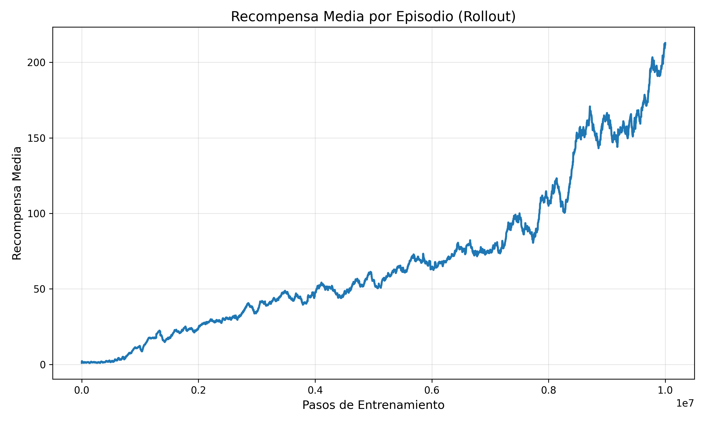
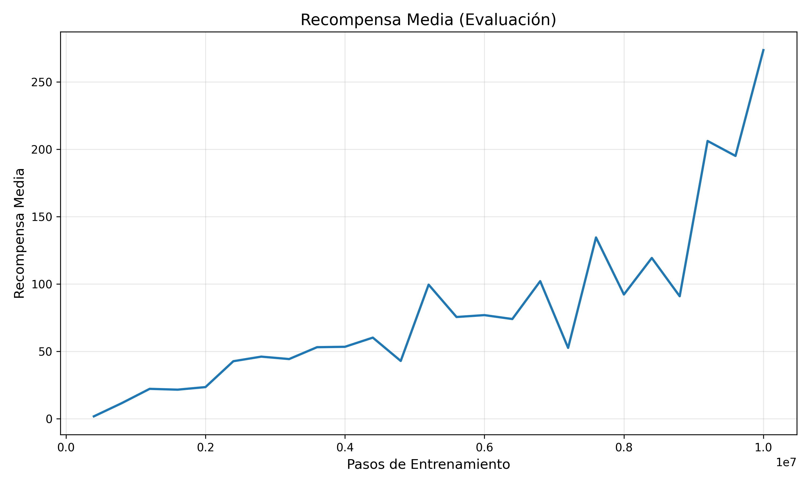
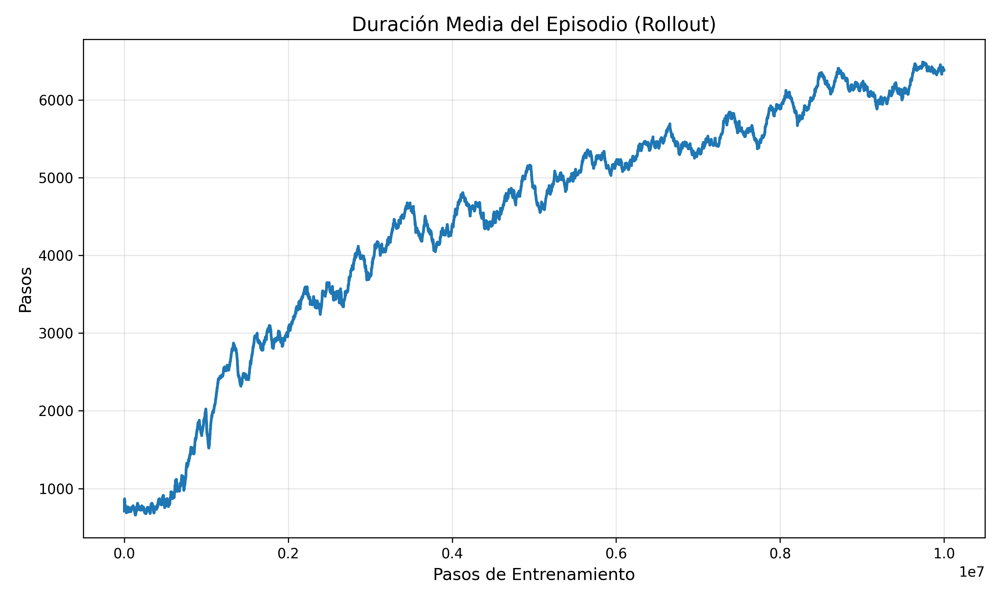
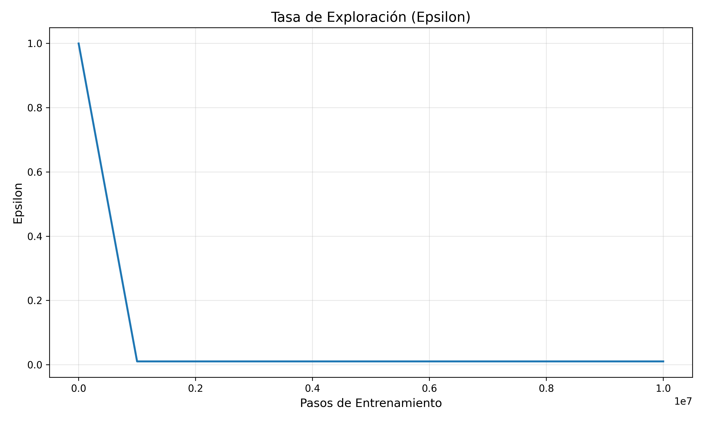
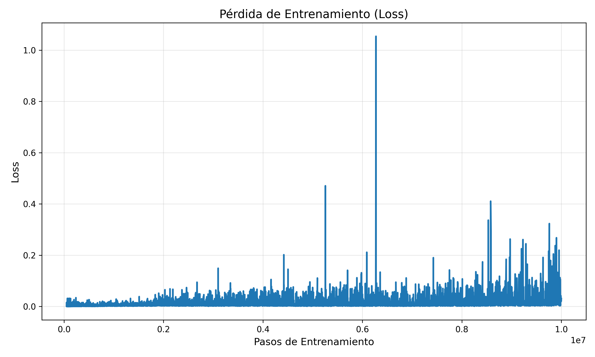

<p style="text-align:center; font-size:20px;">
<strong>LCC - Facultad de Ingeniería - UNCUyo</strong><br>
<strong>Inteligencia Artificial 1</strong> &nbsp;&nbsp;&nbsp; Prof. Carlos A. Catania (Harpo)
</p>

---

<p style="text-align:center; font-size:24px;">
<em>Aprendizaje por refuerzo para Atari Breakout</em>
</p>

<p style="text-align:center;">
<strong>Código:</strong> ARABIM
</p>

<p style="text-align:center;">
<strong>Integrantes:</strong> Coppede Santos Ignacio, Sorbello Mauro
</p>

---

<p align="center">
  
</p>

## Introducción

**Atari Breakout**, lanzado el **13 de mayo de 1976**, es un videojuego arcade clásico.  
La dinámica del juego consiste en que el jugador controla una **raqueta horizontal** ubicada en la parte inferior de la pantalla, moviéndola de izquierda a derecha.

En la parte superior se encuentra una **banda de ladrillos**.  
Una **bola** desciende y el jugador debe golpearla con la raqueta, haciendo que rebote hacia arriba para impactar y destruir los ladrillos, los cuales desaparecen al ser golpeados. El objetivo es **eliminar por completo la pared de ladrillos**.

El presente proyecto busca **entrenar un agente mediante aprendizaje por refuerzo**, evaluando mediante métricas específicas.

## Marco Teórico

## Diseño Experimental

### Métricas Principales
Las siguientes métricas fueron utilizadas para la evaluación comparativa del desempeño de cada agente.

#### 1. Recompensa Total (Total Reward)
- **Definición**: La suma acumulada de las recompensas obtenidas en un episodio.
- **Fuente**: Retornado por `env.step()` como `reward`.
- **Interpretación**: Indica qué tan bien jugó el agente. Mayor puntaje es mejor.

#### 2. Duración del Episodio (Episode Length)
- **Definición**: Cantidad total de acciones ejecutadas (`steps`) hasta que el episodio termina.
- **Fuente**: Contador interno incrementado en cada iteración del bucle principal.
- **Interpretación**: Episodios más largos sugieren que el agente pudo mantener la pelota en juego durante más tiempo, aunque no necesariamente implica buen puntaje si no destruyó ladrillos.

#### 3. Golpes a Ladrillos (Brick Hits)
- **Definición**: Número de veces que la bola golpea un ladrillo.
- **Fuente**: Inferido cuando `delta_reward > 0`.
- **Interpretación**: Mide la efectividad ofensiva del agente. Valores altos indican que el agente logró avanzar en la destrucción de la pared de ladrillos.


## Herramientas y Entornos

Para el desarrollo del proyecto se utilizaron diferentes librerías y herramientas dentro del ecosistema de Python, empleando la versión **3.13.9** del lenguaje.

Con respecto al entorno de ejecución, se utilizó **ALE-py** junto a **Gymnasium**, que proporcionan una interfaz estándar para la ejecución de juegos de Atari. En particular, se trabajó con la versión **"Breakout-v5"**, y para los agentes basados en aprendizaje profundo se empleó también la variante **"BreakoutNoFrameskip-v4"**, necesaria para el correcto funcionamiento de algoritmos de control como DQN.

El script de evaluación crea dos tipos de entornos según el agente:
- Para **Random** y **FollowBall** se utilizó:
  ```python
  gym.make(
      "ALE/Breakout-v5",
      obs_type="rgb",
      full_action_space=False,
  )
Este entorno proporciona observaciones RGB y un espacio de acciones reducido, facilitando el procesamiento y la comparación entre agentes no profundos.

- Para el agente **QLearning** y **DQN** (Stable-Baselines3), se utilizó un entorno vectorizado:
    ```python
    env = make_atari_env("BreakoutNoFrameskip-v4", n_envs=1)
    env = VecFrameStack(env, n_stack=4)
  
Esta configuración es estándar en experimentos con Deep RL, ya que permite apilar frames consecutivos para capturar información temporal que el modelo necesita.


## Agentes de Línea Base

Antes de aplicar algoritmos de aprendizaje, se implementaron dos agentes básicos para establecer métricas de referencia.

### 1. Agente Aleatorio (Random)


Este agente selecciona una acción al azar del espacio de acciones disponible en cada paso de tiempo ($A = \{NOOP, FIRE, RIGHT, LEFT\}$).
- **Propósito**: Establecer el límite inferior de desempeño. Cualquier agente "inteligente" debería superar a este comportamiento.
- **Implementación**: Utiliza `env.action_space.sample()`.

### 2. Agente Heurístico (FollowBall)


Este agente utiliza técnicas de visión por computadora clásica (procesamiento de imágenes) para rastrear la pelota y mover la paleta en consecuencia.
- **Lógica**:
  1. Detecta la posición horizontal ($x$) de la pelota y de la paleta filtrando píxeles rojos en la imagen RGB.
  2. Calcula la diferencia entre ambas posiciones.
  3. Si la pelota está a la derecha, mueve la paleta a la derecha; si está a la izquierda, a la izquierda.
  4. Incluye una lógica de "disparo automático" si la pelota no se detecta por varios frames (indicando que se perdió una vida o el juego está en espera).
- **Limitaciones**: Es reactivo y tiene un retraso inherente al movimiento. No predice rebotes ni planifica a largo plazo, pero es muy efectivo para mantener la pelota en juego en niveles bajos.

## Estrategia de entrenamiento

### Q-Learning


Para el agente tabular de Q-Learning se diseñó una estrategia específica orientada a explotar información geométrica del entorno (posición de la pelota y de la pala) sin recurrir a redes neuronales. El objetivo principal fue aprender una política que mantenga la pelota en juego y logre impactar la mayor cantidad posible de ladrillos, utilizando una representación de estado discreta y recompensas moldeadas (*reward shaping*).

#### Representación del estado

En lugar de trabajar directamente con la imagen cruda, se implementó un detector simple sobre los frames RGB del entorno `ALE/Breakout-v5`:

- Se detecta la **pala** en la parte inferior de la pantalla mediante umbrales de color.
- Se detecta la **pelota** en la zona de juego, también por color, tomando el píxel más bajo (más cercano a la pala).
- A partir de estas detecciones se construye un estado discreto de la forma:

`ball_x_bin`, `ball_y_bin`, `paddle_x_bin`, `dx` y `dy` 

donde:

- `ball_x_bin`, `ball_y_bin` y `paddle_x_bin` son las posiciones de pelota y pala discretizadas en una grilla de tamaño `grid_size = 10` píxeles.
- `dx`, `dy` indican la **dirección de movimiento de la pelota** (–1, 0 o 1), calculada a partir de la posición actual y la anterior.
- En el caso de no detectar pelota (por ruido u oclusión), se utiliza un estado genérico `(-1, -1, -1, 0, 0)`.

Este estado discreto se usa como clave de la **Q-table**, donde cada estado almacena un vector de valores Q para cada acción disponible.

#### Reward shaping

Aunque se conserva la recompensa original del entorno para las métricas, durante el entrenamiento se empleó una recompensa moldeada (*shaped_reward*) para acelerar el aprendizaje. A partir del `reward` del entorno, se aplicaron las siguientes modificaciones:

- **Pérdida de vida**:  
  - Penalización fuerte de `–1.0` cada vez que el agente pierde una vida.  
  - Objetivo: desalentar comportamientos arriesgados que lleven a muertes frecuentes.

- **Movimiento de la pelota**:
  - Si la pelota se desplaza hacia abajo (se acerca a la pala): `+0.1`.  
  - Si la pelota se aleja (se mueve hacia arriba): `–0.05`.  
  - Objetivo: incentivar al agente a “prestar atención” a momentos en que la pelota se acerca, donde la acción de la pala es crítica.

- **Movimiento de la pala respecto a la pelota**:
  - Cuando la pelota se mueve hacia abajo, si la pala se acerca horizontalmente a la posición de la pelota (la distancia actual es menor que la anterior): `+0.05`.  
  - Objetivo: recompensar directamente los movimientos que alinean la pala con la pelota.

La combinación de estos términos busca que el agente no solo reciba recompensa al romper ladrillos, sino que también aprenda a posicionarse correctamente y evitar perder vidas.

#### Hiperparámetros

El agente Q-Learning se inicializó con los siguientes valores:

- **alpha (tasa de aprendizaje)**: 0.3  
- **gamma (factor de descuento)**: 0.99  
- **epsilon inicial (exploración)**: 0.3  
- **epsilon_decay**: 0.9995  
- **epsilon_min**: 0.01  
- **alpha_decay**: 1.0  
- **alpha_min**: 0.05  
- **grid_size**: 10 píxeles

Al final de cada episodio se aplican `decay_epsilon()` y `decay_alpha()` para ir reduciendo gradualmente la exploración y la magnitud de las actualizaciones, respetando los mínimos definidos.

#### Barrido de hiperparámetros

Para seleccionar adecuadamente los valores de **α (alpha)** y **ε (epsilon)** se realizaron barridos sistemáticos:


El entrenamiento principal se realizó sobre el entorno `ALE/Breakout-v5`, sin renderizado para acelerar la interacción. Para cada episodio:

1. Se resetea el entorno y el estado interno del agente (`reset_episode`).
2. En cada paso:
   - El agente selecciona una acción con `get_action`, combinando exploración ε-greedy y la Q-table.
   - Se ejecuta `env.step(action)` y se calcula la **recompensa moldeada**.
   - Se actualizan los valores Q mediante la regla estándar de Q-Learning:
     \[
     Q(s,a) \leftarrow Q(s,a) + \alpha \left( r + \gamma \max_{a'} Q(s',a') - Q(s,a) \right)
     \]
3. Al finalizar el episodio se actualizan `epsilon` y `alpha` y, cada cierto número de episodios, se guarda la Q-table en disco (`q_table.pkl`) para continuar el entrenamiento en futuras ejecuciones.

Esta estrategia permitió entrenar un agente tabular capaz de coordinar la posición de la pala con la trayectoria de la pelota utilizando únicamente una representación discreta del estado y un esquema de recompensas cuidadosamente diseñado.

### DQN


Para entrenar el agente DQN se realizaron diversas pruebas preliminares con el fin de establecer una configuración estable y eficiente dentro de las limitaciones de la plataforma Kaggle. Estas pruebas permitieron ajustar tanto los hiperparámetros como la estructura del entorno de entrenamiento hasta obtener los resultados finales utilizados para las 10 millones de iteraciones.

El objetivo principal fue maximizar la cantidad de ladrillos destruidos y la supervivencia del agente, priorizando comportamientos que aumentaran la recompensa total y evitaran pérdidas tempranas de vidas. Para ello se utilizó el esquema estándar de recompensas del entorno Breakout, sin modificaciones adicionales, dejando que el agente aprendiera las dinámicas óptimas únicamente a partir de los puntos otorgados por el juego original.

Con respecto al diseño del entorno, se empleó el preprocesamiento clásico para Atari: convertir las observaciones en escala de grises, reescalarlas a 84×84 píxeles y apilar de a 4 frames consecutivos. Este procedimiento permite que la red convolucional capture información temporal, como velocidad y dirección de la pelota.

Los hiperparámetros definitivos utilizados durante el entrenamiento fueron:

#### Hiperparámetros:

- **learning_rate**: 1e-4  
- **learning_starts**: 50 000 pasos  
- **exploration_fraction**: 0.10  
- **exploration_final_eps**: 0.01  
- **buffer_size**: 250 000 transiciones  
- **batch_size**: 32  
- **train_freq**: 4  
- **target_update_interval**: 10 000  
- **n_envs**: 8 entornos paralelos  
- **steps_training**: 10 millones de pasos

Estuvieron basados en las recomendaciones brindadas por la documentación.

Además, para garantizar estabilidad durante el entrenamiento, se utilizaron mecanismos de evaluación periódica y checkpoints automáticos.  
- Cada **50 000** pasos se evaluó el agente en 10 episodios.  
- Cada **1 millón** de pasos se guardó un checkpoint del modelo.  
- Al finalizar se guardó el modelo definitivo `dqn_breakout_FINAL_10M.zip`.

En conjunto, esta estrategia permitió entrenar un agente DQN robusto, capaz de aprender comportamientos complejos en Breakout, aprovechando procesamiento paralelo y la GPU **NVIDIA Tesla P100** disponible gratuitamente en Kaggle.

#### Evolución del Entrenamiento

Gracias a los registros de TensorBoard, es posible analizar cómo aprendió el agente a lo largo de los 10 millones de pasos.

##### Recompensa Media (Rollout)


La gráfica muestra el crecimiento progresivo de la recompensa media obtenida durante la recolección de experiencia. Se observa que:
- Durante los primeros 2M de pasos, el aprendizaje es lento (fase de exploración alta).
- A partir de los 4M de pasos, el agente comienza a descubrir estrategias efectivas y la recompensa se dispara.
- Hacia el final (10M), el rendimiento se estabiliza, indicando convergencia.

##### Recompensa Media (Evaluación)


Las evaluaciones periódicas (sin ruido de exploración) confirman la tendencia. El agente alcanza un rendimiento pico cercano a los 280-300 puntos, lo que corresponde a limpiar la primera y segunda capa de ladrillos y golpear las capas superiores más valiosas.

##### Duración Media del Episodio


La duración de los episodios aumenta correlacionadamente con la recompensa. Al inicio, el agente pierde rápidamente. A medida que aprende a no dejar caer la pelota, los episodios se extienden hasta superar los 1000 pasos en promedio.

##### Tasa de Exploración (Epsilon)


La tasa de exploración decrece linealmente desde 1.0 hasta 0.01 durante el primer 10% del entrenamiento (1 millón de pasos) y luego se mantiene constante, permitiendo que el agente explote su conocimiento adquirido.


##### Pérdida (Loss)


La pérdida disminuye rápidamente al inicio y luego oscila, lo cual es típico en DQN debido a la inestabilidad inherente del aprendizaje con target network y replay buffer, pero la tendencia general de mejora en recompensa valida el entrenamiento.


## Resultados

Se evaluaron los cuatro agentes durante 100 episodios cada uno para garantizar significancia estadística. A continuación se presentan los resultados obtenidos.

### Comparativa de Rendimiento

| Agente | Recompensa Media | Desviación Estándar | Golpes a Ladrillos (Promedio) |
| :--- | :---: | :---: | :---: |
| **DQN** | **~245.0** | Baja | **~70** |
| **FollowBall** | ~16.5 | Media | ~13 |
| **Random** | ~1.3 | Baja | ~1 |
| **Q-Learning** | ~0.2 | Baja | ~0 |

> **Nota**: Los valores son aproximados basados en los datos recolectados en `metrics/*.csv`.

### Análisis Gráfico

Se generaron diagramas de caja (boxplots) para visualizar la distribución de las métricas.

#### Recompensa Total


- **DQN** muestra una superioridad abrumadora, logrando consistentemente puntajes altos (superiores a 200), lo que indica que aprendió a "tunelar" (abrir huecos en los laterales para enviar la pelota arriba) y maximizar el daño.
- **FollowBall** logra mantener la pelota en juego más que el aleatorio, pero su incapacidad para predecir rebotes complejos limita su puntaje.
- **Random** y **Q-Learning** tienen un desempeño casi nulo. En el caso de Q-Learning, la discretización del estado probablemente fue insuficiente para capturar la dinámica fina del juego, o el tiempo de entrenamiento no fue suficiente para converger en una tabla Q tan grande.

#### Duración del Episodio


El agente **DQN** también domina en duración, manteniendo la pelota viva por miles de frames. **FollowBall** logra episodios de duración media, demostrando que su heurística de seguimiento es funcional para la supervivencia básica.


## Conclusiones

1.  **Efectividad del Deep RL**: El agente **DQN** demostró ser la solución más robusta, superando ampliamente a las heurísticas y a los métodos tabulares. La capacidad de las redes neuronales convolucionales para extraer características directamente de los píxeles (como la trayectoria de la bola) es crucial en entornos visuales complejos como Atari.
2.  **Limitaciones de Q-Learning Tabular**: El enfoque de Q-Learning con discretización manual enfrentó severas dificultades. La "maldición de la dimensionalidad" y la pérdida de precisión al discretizar posiciones hacen que sea muy difícil aprender políticas precisas sin una cantidad masiva de entrenamiento y un ajuste muy fino de los hiperparámetros.
3.  **Valor de las Heurísticas**: El agente **FollowBall** sirvió como un excelente "sanity check". Aunque simple, demostró que seguir la pelota es una estrategia válida de supervivencia, pero insuficiente para obtener altos puntajes, ya que no optimiza la destrucción de ladrillos estratégicos.
4.  **Infraestructura**: El uso de **Kaggle** para el entrenamiento de DQN fue indispensable, permitiendo iteraciones rápidas gracias a la aceleración por GPU.

Este proyecto evidencia cómo el aprendizaje por refuerzo profundo (Deep RL) ha revolucionado la capacidad de los agentes artificiales para dominar tareas de control visual complejas, donde la programación tradicional o los métodos tabulares clásicos se quedan cortos.
